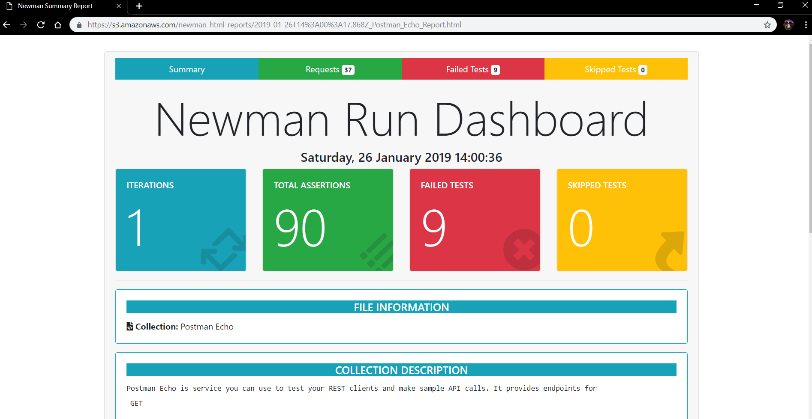

# simple-newman-html-file-upload-to-s3

For a while now I've been focusing all my efforts on creating a [newman reporter](https://github.com/DannyDainton/newman-reporter-htmlextra) that produces a custom HTML report for a Postman Collection.

Running Newman locally will create a new report on my local file system, which is fine, but I wanted to integrate this report into a [Slack bot](https://github.com/DannyDainton/basic-newman-slack-bot), I have also created. This would have a hyperlink within the slack message, that would allow anyone to access and view the report for that particular test run, in a web browser.

There are a number of different ways to achieve this and store the report but I found that saving these to an AWS S3 Bucket, was by far the easiest. I'm going to use this repository to show you how to do this in the most basic way, hopefully this will give anyone a starting point and something to adapt and iterate on in they're own context.

### Let's get started...

There is a huge assumption being made on my part, that the people reading and following this example, already have an AWS account and know how to create an empty S3 Bucket, to store our reports. 

I'm not going to spend extra time explaining step by step how to do these things, your best bet is to head over to the [AWS site and follow the setup guides](https://aws.amazon.com/premiumsupport/knowledge-center/create-and-activate-aws-account/) on there, before moving through this repository. I wanted to keep the focus of the repository on the uploading example.

Some more information on the [S3 Bucket Setup](https://docs.aws.amazon.com/s3/index.html?nc2=h_ql_doc#lang/en_us) for you to check out.

Additional [AWS Security Credential Information](https://docs.aws.amazon.com/general/latest/gr/aws-security-credentials.html) can be found here, this will explain in better detail, how to create the Auth Credentials.

Once the bucket has been created, you should have something that looks like this one:


The only bits of information that you will need to get and remember from your AWS account are:

- Access Key Id
- Secret Access Key
- Region eg. '_us-east-1_'
- Bucket Name eg. '_newman-reports_' 

### How does it all work...

First off, you will need to clone this repository and install the node modules. Open a terminal on the cloned directory and then use the `npm install` command in the terminal.

In order to send the newman report to S3, you will need to update the `file_upload_practice.js` file with the `region` and your `Auth Credentials`. You're looking for the place in the script that looks like this:

```javascript
const s3 = new AWS.S3({
    accessKeyId: "<Enter Access Key Id>", 
    secretAccessKey: "<Enter Secret Access Key>", 
    region: "<Enter Region>"
})
```

**Note:** This is _only_ a quick example of how to link these things up, Don't add the credentials like this if you're hooking this up elsewhere, you really don't want to keep all of these Auth details together in the same place. Ideally, the property values would just contain a reference to something external, like an environment variable.

If you've used [Newman](https://github.com/postmanlabs/newman) in a script before, this all may look familiar. If you've always used Newman from the command line, this might look a little bit strange but all it's really doing is running this command:

`newman run https://www.getpostman.com/collections/631643-f695cab7-6878-eb55-7943-ad88e1ccfd65-JsLv -r htmlextra --reporter-htmlextra-export ./reports/Postman_Echo_Test_Run.html`

I've just extended the normal `newman run` command with some additional information, which allows us to do lots of cool things but this time, all we're doing is writing some extra code to upload the HTML report to an S3 bucket.

We'll be using the `Postman-Echo` collection for this example, it contains a decent set of requests that will produce a meaningful report. I've added a `fileDate` variable to create a unique filename for each report. This is just adding a timestamp as a prefix, to the hard-coded `Key` property.

The only thing that will need to be changed within this part of the script is the `Bucket` property value, once this has been changed and saved, we are ready to give it a go...Before we run the script, I just want to explain what's going on.

The first part of the script is creating the report like it normally would if you were using the reporter from the command line. The `export` property on the reporter is saving the file to the location I've entered.

In the second part of the script, I'm using Node's built-in `fs` module to read that file and the `Buffer` module is converting this to  binary data and saving it as the `reportData` variable. In the `Body` property of the `Params` object, I'm using this variable to tell S3 what data to add to the uploaded file. From here the `s3.putObject()` function from the `aws-sdk` module is doing the magic to add it to the S3 Bucket.

```javascript
newman.run({
    collection: 'https://www.getpostman.com/collections/631643-f695cab7-6878-eb55-7943-ad88e1ccfd65-JsLv',
    reporters: ['htmlextra'],
    reporter: {
        htmlextra: {
            export: './reports/Postman_Echo_Test_Run.html'
        }
    }
}, (err) => {
    if (err) { throw err; }

    fs.readFile('./reports/Postman_Echo_Test_Run.html', (err, data) => {
        if (err) { throw err }
    
        var reportData = new Buffer.from(data);
    
        const params = {
            Bucket: '<Enter S3 Bucket Name>',
            Key: `${fileDate}_Postman_Echo_Report.html`,
            ContentType: 'text/html',
            Body: reportData,
            ACL:'public-read'
        }
        
        s3.putObject(params, (err) => {
            if (err) { throw err; }
            console.log("Report uploaded to S3")                                     
        })
    })
})

```

To run the script, you can use the `npm start` command from your terminal.

Once the script has been run, you will see a very basic `Report uploaded to S3` response logged out to the console, this _could_ say anything, it's just telling us that there wasn't an error during the run and your report is waiting for you in the bucket.

You should see something like this in your AWS console:


### Viewing your report...

Each report within the bucket will have it's own `public` link, this can be found in the metadata of the file object. If the correct setting have been applied, this link will be publicly accessible by anyone.


Clicking on the `Object URL` link, will open the newly created report in a browser.



So my aim while doing this was to add this as a hyperlink on a Slack bot, I achieved this by adding this basic implementation, it didn't need to be anymore than this, into my application and referenced the same `filename` on a label from my formatted Slack message.

Anyone who can see this Slack message, from anywhere in the world, can open the report and see the results of the newman run. :)

---

That's a very basic and very simple example of how you _could_ add an external storage element to your own Newman scripts. This is not going to work for all contexts but hopefully it will give you an idea about how this can be done.
